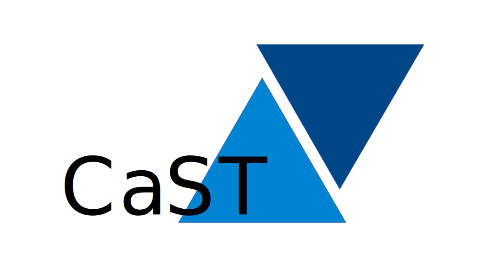

  

# CaST: A (somewhat) Minimalist CST FEM Solver

**CaST** is a minimalist, open-source application designed for defining and solving 2D-Elastic Finite Element Method (FEM) problems.

This software was initially developed as a project for the *Introduction to the Finite Element Method* course at the University of Brasília (UnB).

---

## Requirements

This project relies on a hybrid architecture. The graphical interface and data management are built in **Python**, while the heavy mathematical lifting and linear algebra system assembly are offloaded to a high-performance **Julia** backend.

**You MUST have both installed on your system to run the solver.**

### 1. Python

- **Version:** Python 3.10 or higher

### 2. Julia

* **Version:** Julia 1.9 or higher.
* **System PATH**: ensure that julia is recognized by PATH, python calls it using subprocess
* In case of failure, you can manually add the julia executable to the code in `model.py`at `solve_mesh`
* **Dependencies:** The Julia engine uses `JSON`, `LinearAlgebra`, and `SparseArrays`. The Python script will attempt to automatically run `Pkg.instantiate()` on the first execution to set up the Julia environment.

---

## Features

* **Interactive GUI:** A custom-built, MVC-architected interface using Tkinter and a modern dark theme.
* **Geometric Modeling:** Draw nodes and connect them with linear edges or 2nd-degree isoparametric curves (parabolas and circles).
* **Boundary Conditions:** Easily apply $X$, $Y$ fixed supports to individual nodes or entire edges.
* **Loading Profiles:** Apply point loads to nodes, or distributed loads (constant and trapezoidal) to edges. Distributed loads can be oriented normally (pressure) or globally.
* **Material Properties:** Define Young's Modulus ($E$), Poisson's ratio ($\nu$), and specific weight ($\gamma$) to automatically account for self-weight in calculations.
* **Meshing:** Automatic triangulation of the defined domains into Constant Strain Triangles using `gmsh`. Code is not that well built, so high count of elements may stutter the app!
* **Solver Options:** Support for both **Plane Strain** and **Plane Stress** linear elastic formulations.
* **Results Visualization:**
  * Exaggerated deformed shape rendering.
  * Node displacement vectors.
  * Support reaction forces.
  * Interactive **Von Mises Stress Heatmaps** with cursor-hover tooltips detailing element-specific stress tensors ($\sigma_x$, $\sigma_y$, $\tau_{xy}$).
* **Save/Load:** Export and import your models as `.json` files.

---

## Installation & Setup

1. **Clone the repository:**

   ```bash
   git clone https://github.com/yourusername/CaST.git
   cd CaST
   ```
2. **Install Python dependencies:**

   (recommended) Create a virtualenv with whatever library you prefer. Most general is

   ```Shell
   python -m venv env_name
   ```

   Then, install the requirements:

   ```bash
   pip install -r requirements.txt
   ```
3. **Install Julia:**
   Download and install Julia from the [official website](https://julialang.org/downloads/). Ensure you check the box to "Add Julia to PATH" during installation.
4. **Run the Application:**

   ```bash
   python main.py
   ```

# Author

---

Created by Vítor Luís Costa Azevedo. I am quite fond of FEM :).

Free use to do whatever you like with the code, just thank me if you're kind. [s]()
